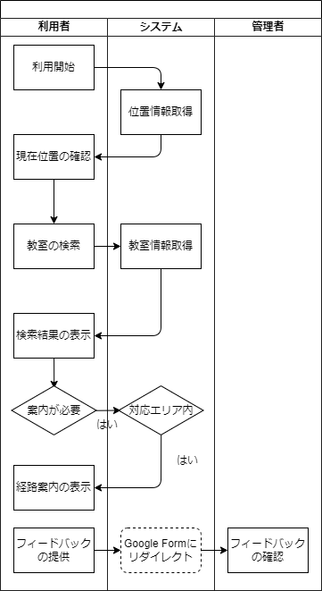

# 基本設計書

## 1. システム方式設計
### 1.1 システム概要
#### 目的
来場者がスムーズに教室を見つけられるように、校内フロアマップシステムを作成し案内を行うことを目的としています。
### 1.2 システム構成
#### 業務フロー

#### ソフトウェア/ハードウェア方式
#### システム構成図
## 2. 画面設計
### 2.1 画面一覧
### 2.2 画面遷移図
## 3. 機能設計
### 3.1 機能一覧
## 4. データベース設計
### 4.1 テーブル定義
## 4. 開発体制
### 4.1 開発スケジュール
### 4.2 開発環境