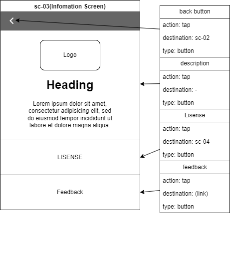

# 基本設計書

## 1. システム方式設計
### 1.1 システム概要
#### 目的
来場者がスムーズに教室を見つけられるように、校内フロアマップシステムを作成し案内を行うことを目的としています。
### 1.2 システム構成
#### 業務フロー

#### ソフトウェア/ハードウェア方式
フロントエンド:　Flutter/Dartで開発

バックエンド: ホスティングはfirebase、データベースはsupabaseを使用

ハードウェア: MicroBitをBLEビーコンとして使用、各階に配置
#### システム構成図

## 2. 画面設計
### 2.1 画面一覧
#### map screen

### 2.2 画面遷移図

## 3. 機能設計
### 3.1 機能一覧
| No. | 機能概要  | 優先度 | 
| --- | --------- | ----- |  
| 1   | マップ表示  |  高  |
| 2   | 教室の検索、情報の表示 |  高  |
| 3   | 現在位置の表示 |  高  |
| 4   | 経路案内 |  中  |
| 5   | フィードバック機能 |  低  |

## 4. データベース設計
### 4.1 テーブル定義
#### 教室テーブル(Classroom Table)
| フィールド名 | 型 | 概要 |
| ---------- | -- | --- |
| ID | INT | 教室の一意のID(PK) |
| Tower | CHAR | 教室が存在する棟 |
| Floor | INT | 教室が存在する階 |
| ClassNum | INT | 教室の番号 |
| EventID | INT | 教室で開催されているイベントの識別子(FK) |
#### イベントテーブル(Event Table)
| フィールド名 | 型 | 概要 |
| ---------- | -- | --- |
| EventID | INT | イベントの一意のID(PK) |
| EventName | CHAR | イベント名 |
| UserGrade | INT | 教室を使用するクラスの学年 |
| UserClass | INT | 教室を使用するクラスの組 |
| EventDetail | TEXT | イベントの概要 |
#### ビーコンテーブル(Beacon Table)
| フィールド名 | 型 | 概要 |
| ---------- | -- | --- |
| BeaconID | INT | ビーコンの一意のID(PK) |
| CorrFloor | INT | 対応するビーコンの階 |

### ER図

